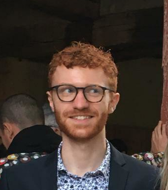

I am a third-year Ph.D. student at Université Paris-Saclay, conducting my research at ONERA (The French Aerospace Lab) and IMS Laboratory. My work focuses on the study of generative models—particularly diffusion models—for solving inverse problems in imaging. I am interested in understanding and improving the ability of these models to recover high-fidelity images from incomplete or corrupted observations, with applications spanning scientific and medical imaging.

## Interests

- Inverse problems in imaging
- Generative modelling
    - Diffusion models

## Screenshots

